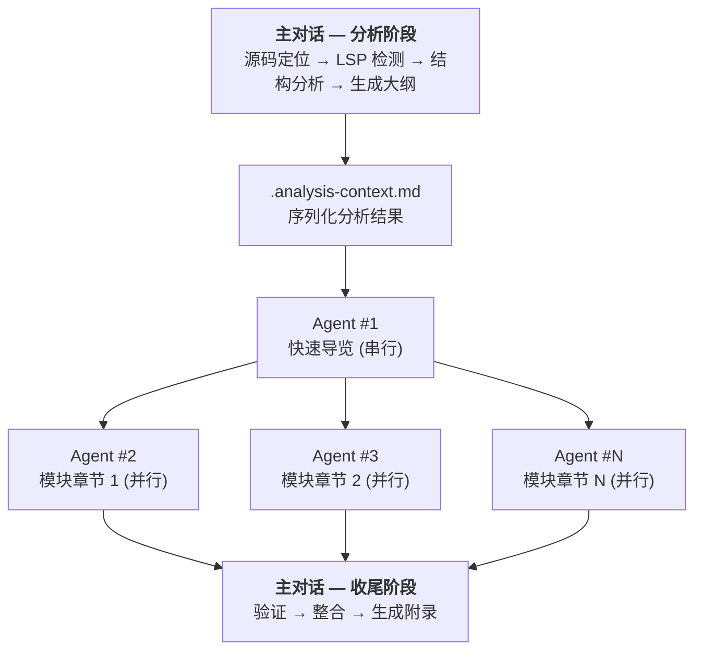

# Study-Master Skill

> 一个 Claude Code skill，帮助程序员通过 AI 自动生成教科书级别的源码学习文档。

输入一行命令，获得一份 50-100 页的深度解析文档 —— 覆盖架构全景、模块剖析、数据结构、关键算法，以教科书风格渐进展开。

## 核心特性

- **教科书风格**：先整体后局部、先接口后实现、先主流程后边界、先概念后代码
- **多层次代码展示**：调用关系图 → 伪代码 → 真实代码 → 实现细节逐层深入
- **Subagent 并行架构**：多个 AI agent 并行生成各章节，高效处理大型项目
- **LSP 智能分析**：自动检测 Language Server Protocol，提供精确的符号定位和调用链追踪
- **自动格式校验**：PostToolUse hook 实时检查生成内容，确保格式一致性
- **灵活的源码定位**：自动搜索或手动指定源码路径，支持源码、协议规范、语言内部机制

## 工作原理



每个 subagent 独立读取 `.analysis-context.md` 获取上下文，拥有自己的上下文窗口，不会因项目规模膨胀而溢出。

## 快速开始

### 安装

```bash
cd study-master-skill
./install.sh
```

安装后会将 skill 和格式校验 hook 部署到 Claude 配置目录：

| 安装内容 | 目标位置 |
|---------|---------|
| SKILL.md（核心工作流） | `~/.claude/skills/study-master/` |
| format-rules.md（格式规范） | `~/.claude/skills/study-master/` |
| analysis-guide.md（分析方法） | `~/.claude/skills/study-master/` |
| document-templates.md（文档模板） | `~/.claude/skills/study-master/` |
| 格式校验 hook | `~/.claude/hooks/` |

### 使用

```bash
# 自动查找源码
/study-master redis

# 手动指定源码路径
/study-master tcp-ip --source /path/to/tcp-specs
```

### 推荐项目结构

```
your-project/
├── src/                    # 源码（至少 src/ 或 docs/ 之一存在）
│   ├── redis/
│   └── nginx/
├── docs/                   # 协议规范文档
│   └── tcp-ip-specs/
└── study/                  # 生成的学习文档（自动创建）
    ├── redis/
    └── tcp-ip/
```

源码自动查找优先级：`src/<topic>/` → `src/*<topic>*/` → `docs/<topic>/` → `docs/*<topic>*/` → `./<topic>/`

## 生成的文档结构

```
study/<topic>/
├── .analysis-context.md        # 分析上下文（中间产物，供 subagent 读取）
├── 00-overview.md              # 快速导览
│   ├── 项目/协议简介
│   ├── 核心概念速览
│   ├── 典型场景剖析（完整执行路径追踪）
│   ├── 架构全景图（Mermaid）
│   └── 学习路线图
├── 01-module-xxx.md            # 模块深度解析
│   ├── 模块概述（职责、边界、交互接口）
│   ├── 多层次代码展示
│   ├── 数据结构深度解析
│   ├── 关键算法剖析
│   ├── 设计决策分析
│   └── 学习检查点（总结 + 思考题）
├── 02-module-yyy.md
├── ...
├── appendix-references.md      # 参考资料索引
└── .study-meta.json            # 元数据
```

## 格式规范与质量控制

生成的文档遵循严格的格式标准，通过 PostToolUse hook 自动校验：

| 规则 | 说明 |
|------|------|
| 链接格式 | 仅使用相对路径，禁止 `file:///` |
| 图表 | 必须使用 Mermaid，禁止 ASCII art |
| 数学符号 | 必须使用 LaTeX（`$2^{31}$`），禁止 Unicode 数学字符 |
| 代码块 | 必须标注语言标识 |
| 反引号 | 链接内标识符不加反引号，纯文本标识符必须加 |
| 源码引用 | 格式：`> 📍 源码：[file:line-line](path#Lline)` |

校验工具会在每次写入 `study/` 目录下的 `.md` 文件时自动运行，发现违规立即报告。

## 项目结构

```
learning-skills/
├── README.md                       # 本文件
├── study-master-skill/             # Skill 主目录
│   ├── SKILL.md                    # 核心工作流定义（~160 行）
│   ├── format-rules.md             # 格式规范
│   ├── analysis-guide.md           # 源码分析方法（LSP、函数级分析）
│   ├── document-templates.md       # 文档模板与分段输出规则
│   ├── install.sh                  # 安装脚本
│   ├── README.md                   # Skill 使用说明
│   └── hooks/
│       ├── check-study_master.sh   # PostToolUse hook（shell 入口）
│       └── validate_study_master.py # 格式校验器（Python）
└── docs/plans/                     # 设计文档与实现计划
    ├── 2026-03-12-study-master-skill-design.md
    ├── 2026-03-12-study-master-implementation.md
    ├── 2026-03-13-study-master-simplification-design.md
    ├── 2026-03-13-study-master-simplification-plan.md
    ├── 2026-03-13-subagent-chapter-generation-design.md
    └── 2026-03-13-subagent-chapter-generation-plan.md
```

### 模块化设计

SKILL.md 仅保留核心工作流（~160 行），将细节拆分到独立文件中按需读取：

- **format-rules.md**：格式规范细节，subagent 在生成前读取
- **analysis-guide.md**：LSP 检测、分析方法表、函数级分析工作流、序列化指南
- **document-templates.md**：快速导览和模块章节模板、分段输出规则、元数据格式

这种设计降低了初始上下文负载，同时保持信息的完整可用性。

## 设计演进

| 阶段 | 内容 |
|------|------|
| v1 — 初始设计 | 单对话生成所有章节，SKILL.md 含全部细节（~333 行） |
| v2 — 模块化拆分 | SKILL.md 精简至 ~120 行，拆分出 3 个辅助文件 |
| v3 — Subagent 架构 | 引入分布式生成：主对话分析 + subagent 并行写作，解决大项目上下文溢出问题 |

详细设计文档见 `docs/plans/` 目录。

## License

MIT
