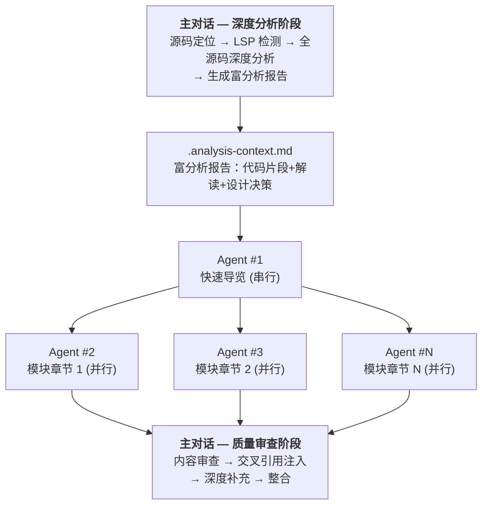

# Study-Master 1M 上下文优化 实施计划

> **For Claude:** REQUIRED SUB-SKILL: Use superpowers:executing-plans to implement this plan task-by-task.

**Goal:** 利用 Opus 4.6 的 1M 上下文和 128K 输出能力，重构 study-master skill 以提升文档分析深度和生成速度。

**Architecture:** 主 dialog 在 1M 上下文中做全源码深度分析，生成富分析报告（含代码片段和解读），subagent 从"分析+生成"转变为"纯生成"角色，主 dialog 在后处理阶段做交叉引用注入和深度补充。

**Tech Stack:** Claude Code skill（Markdown 规范文件），Python（格式校验 hook，无变更）

**设计文档：** `docs/plans/2026-03-14-1m-context-optimization-design.md`

---

### Task 1: 更新 format-rules.md — 移除分段输出限制

**Files:**
- Modify: `format-rules.md`（当前 99 行，无需大改）

**Step 1: 确认当前文件内容**

Run: `cat -n format-rules.md | head -5`
Expected: 文件以 `# 文档格式规范` 开头

**Step 2: 验证 format-rules.md 无分段输出相关内容**

format-rules.md 本身不包含分段输出规则（分段规则在 document-templates.md 第 3 节）。format-rules.md 保持不变。

**Step 3: 确认无需修改**

Run: `grep -n "分段\|≤.*行\|cat >>" format-rules.md`
Expected: 无匹配，确认此文件不涉及分段输出限制

---

### Task 2: 更新 document-templates.md — 富分析报告模板 + 移除分段限制

**Files:**
- Modify: `document-templates.md`（当前 103 行）

**Step 1: 阅读当前文件确认结构**

Run: `grep -n "^##" document-templates.md`
Expected: 6 个二级标题（第 1-6 节）

**Step 2: 替换第 3 节（分段输出规则 → 输出规则）**

将第 3 节从：
```markdown
## 3. 分段输出规则

必须分段写入文件，避免一次输出过长内容：

- 初始文件创建：使用 Write 工具，内容 ≤ 50 行
- 后续追加：使用 `cat >>` 命令，每次 ≤ 80 行
- 大章节：分 3-5 次追加完成
```

替换为：
```markdown
## 3. 输出规则

使用 Write 工具一次性输出完整章节文件，不再需要分段写入。

- 每个章节由一次 Write 调用完成
- 生成完成后用 Read 验证无乱码和格式问题
```

**Step 3: 替换第 6 节（Analysis Context 模板升级为富分析报告）**

将第 6 节从当前的"指针表"模板替换为"富分析报告"模板：

```markdown
## 6. 富分析报告模板（.analysis-context.md）

此文件由主对话在阶段 4 生成。主对话利用 1M 上下文完成全源码深度分析后，将分析结论序列化到此文件，供 subagent 读取并直接用于文档生成。

### 项目概况部分

- **项目名称**：{name}
- **类型**：{源码项目 / 协议规范 / 语言内部机制}
- **源码根路径**：{source_root}
- **LSP 状态**：{已使用 / 不可用 / 未检测到}

### 项目全局架构分析

深度解读项目整体设计理念、分层结构、核心数据流。不只是列出模块，而是分析**为什么**这样分层、各层之间的契约关系、设计上的关键 tradeoff。

### 源码路径映射

表格格式，每行一个模块：`| 模块名 | 文件路径列表 |`

### 学习大纲

表格格式：`| 章节编号 | 标题 | 对应模块 | 内容要点（3-5 bullet） |`

### 模块深度分析（每个模块一节）

每个模块包含以下子节：

#### 设计意图
- 该模块存在的原因，解决什么核心问题
- 在系统中承担什么角色，与其他模块的边界

#### 核心函数表
- 表格格式：`| 函数名 | 位置（文件:行号范围） | 职责描述 |`

#### 关键代码片段与解读
- 选取该模块最核心的 3-5 个函数/代码段
- 包含实际源码片段（关键部分，非完整文件）
- 每段代码后附逐段解释：这段代码做了什么、为什么这样写、关键设计决策

#### 调用关系与数据流
- 该模块调用谁、被谁调用
- 关键数据在模块间如何流转
- 用文字描述核心交互链路

#### 关键数据结构
- 核心结构体/类定义（含字段含义）
- 生命周期管理方式

#### 设计决策与 Tradeoff
- 为什么选择当前实现方案
- 考虑过哪些替代方案、为什么放弃
- 性能/复杂度/可维护性上的权衡

### 模块间关系分析

跨模块的数据流、依赖关系、耦合度分析。重点关注：
- 哪些模块是高耦合的，为什么
- 关键的跨模块调用链
- 系统中的数据流主路径

### 格式规范摘要

指向完整规范文件，附关键规则摘要：
- 源码位置格式：`> 📍 源码：[文件名:起始行-结束行](相对路径#L起始行)`
- 图表必须用 Mermaid，禁止 ASCII art，节点总数 ≤ 20，同层 ≤ 6
- 链接文本不加反引号；无链接标识符必须加反引号
- 数学符号用 LaTeX，禁止 Unicode 数学符号
- 代码块必须指定语言标识
```

**Step 4: 验证修改结果**

Run: `grep -n "分段\|≤.*行\|cat >>" document-templates.md`
Expected: 无匹配（分段限制已移除）

Run: `grep -n "富分析报告\|深度分析\|设计意图\|代码片段与解读\|Tradeoff" document-templates.md`
Expected: 多处匹配，确认富分析报告模板已就位

**Step 5: 提交**

```bash
git add document-templates.md
git commit -m "refactor(templates): upgrade analysis context to rich report format

Replace pointer-based .analysis-context.md template with deep analysis
report including code snippets, design intent, and tradeoff analysis.
Remove segmented output limit (50/80 lines), allow single Write per chapter."
```

---

### Task 3: 更新 analysis-guide.md — 面向主 Dialog 深度分析

**Files:**
- Modify: `analysis-guide.md`（当前 88 行）

**Step 1: 阅读当前文件确认结构**

Run: `grep -n "^##" analysis-guide.md`
Expected: 6 个二级标题（第 1-6 节）

**Step 2: 重构文件内容**

analysis-guide.md 的受众从"subagent 按需读取"变为"主 dialog 深度分析参考"。保留 LSP 相关内容（第 1-3 节基本不变），更新第 4-6 节。

将第 4 节（函数级分析工作流）更新为更深入的分析流程：

```markdown
## 4. 函数级深度分析工作流

主对话在 1M 上下文中对每个核心函数执行以下深度分析：

1. **获取签名**：LSP hover / 头文件提取
2. **查找调用关系**：LSP findReferences / Grep
3. **构建调用树**：LSP callHierarchy / 手动推断
4. **阅读源码**：Read 函数完整实现，理解内部逻辑
5. **深度解读**：
   - 函数的设计意图（不只是"做什么"，还有"为什么这样做"）
   - 关键代码段的逻辑解释
   - 错误处理策略和边界条件
   - 与其他模块的交互方式
6. **生成执行路径追踪**：
   - Mermaid sequenceDiagram 展示调用顺序
   - 标注参数值、返回值、状态变化
   - 区分：正常路径、错误处理、边界条件
7. **记录分析结论**：将以上分析结果写入 `.analysis-context.md` 对应模块的"关键代码片段与解读"部分

LSP 可用时的标注格式：
- **函数签名**（来自 LSP hover）
- **调用关系**（共 X 次引用，来自 LSP findReferences）
- **调用树深度**：N 层（来自 LSP callHierarchy）

LSP 不可用时的标注格式：
- **函数签名**（从头文件提取）
- **调用关系**（基于 Grep 搜索）
```

将第 6 节（序列化分析结果）更新为富分析报告序列化：

```markdown
## 6. 序列化深度分析结果

阶段 4 完成深度分析后，将所有分析结论写入 `study/<topic>/.analysis-context.md`，供 subagent 直接用于文档生成。

### 序列化步骤

1. **收集项目概况**：项目名称、类型、源码根路径、LSP 状态
2. **撰写全局架构分析**：整体设计理念、分层结构、核心数据流的深度解读
3. **构建路径映射表**：每个模块对应的源码文件路径列表
4. **撰写模块深度分析**：对每个模块，写入设计意图、核心函数表、关键代码片段与逐段解读、调用关系、数据结构、设计决策
5. **撰写模块间关系分析**：跨模块数据流、依赖关系、耦合度分析
6. **写入文件**：使用 Write 工具生成 `.analysis-context.md`

### 内容丰富度原则

- **包含实际代码片段**：选取每个模块最核心的 3-5 个函数关键部分，直接嵌入
- **包含逐段解读**：每段代码后附解释，不只列签名
- **包含设计决策**：记录"为什么这样设计"，不只是"做了什么"
- **包含跨模块关系**：记录模块间的数据流和交互模式

### .analysis-context.md 模板

见 [document-templates.md](document-templates.md) 第 6 节。
```

**Step 3: 验证修改结果**

Run: `grep -n "只存指针\|≤ 30 行\|不复制源码" analysis-guide.md`
Expected: 无匹配（旧的"指针而非内容"策略已移除）

Run: `grep -n "深度分析\|代码片段\|设计意图\|设计决策" analysis-guide.md`
Expected: 多处匹配

**Step 4: 提交**

```bash
git add analysis-guide.md
git commit -m "refactor(analysis): shift to deep analysis for main dialog

Update function-level analysis workflow to include source code reading
and design intent analysis. Replace pointer-based serialization with
rich analysis report containing code snippets and interpretations."
```

---

### Task 4: 重构 SKILL.md — 核心工作流升级

**Files:**
- Modify: `SKILL.md`（当前 160 行，这是最大的改动）

这是最关键的任务，需要修改 Stage 3、Stage 4、Stage 5、Stage 6-N 和 Finalization 阶段。

**Step 1: 阅读当前 SKILL.md 确认所有阶段**

Run: `grep -n "^###" SKILL.md`
Expected: 阶段 0-6 + 最后阶段 + 文档结构 + 质量控制

**Step 2: 更新阶段 3（项目结构分析 → 全源码深度分析）**

将当前阶段 3：
```markdown
### 阶段 3：项目结构分析

根据 LSP 可用性选择分析方法，识别核心模块、热点函数和模块依赖关系。

> 📖 详见 [analysis-guide.md](analysis-guide.md) 第 2-3 节
```

替换为：
```markdown
### 阶段 3：全源码深度分析

利用 1M 上下文窗口，执行全源码深度分析：

1. **源码加载**：Read 项目所有核心源文件到上下文中（1M 上下文可加载约 30000 行代码）
2. **结构分析**：根据 LSP 可用性选择分析方法，识别核心模块、热点函数和模块依赖关系
3. **深度解读**：在拥有全部源码的上下文中完成以下分析：
   - 每个模块的设计意图和职责边界
   - 关键算法和核心函数的逻辑解读（不只是签名，要理解设计动机）
   - 模块间的耦合关系和数据流
   - 关键设计决策和 tradeoff 分析
4. **热点函数深度分析**：对每个核心函数，阅读完整实现，理解内部逻辑、错误处理策略和与其他模块的交互方式

> 📖 分析方法详见 [analysis-guide.md](analysis-guide.md) 第 2-4 节
```

**Step 3: 更新阶段 4（生成学习大纲与序列化 → 富分析报告序列化）**

将当前阶段 4：
```markdown
### 阶段 4：生成学习大纲与序列化

基于分析结果确定章节划分，识别核心模块和学习路径，生成文档目录结构。明确列出所有需要生成的章节。

完成大纲后，将分析结果序列化写入 `study/<topic>/.analysis-context.md`，供后续 subagent 读取。

> 📖 章节模板详见 [document-templates.md](document-templates.md)
> 📖 Analysis Context 模板详见 [document-templates.md](document-templates.md) 第 6 节
> 📖 序列化指南详见 [analysis-guide.md](analysis-guide.md) 第 6 节
```

替换为：
```markdown
### 阶段 4：生成学习大纲与富分析报告

基于阶段 3 的深度分析，确定章节划分和学习路径，明确列出所有需要生成的章节。

将全部深度分析结论序列化为**富分析报告**，写入 `study/<topic>/.analysis-context.md`。报告包含：
- 项目全局架构的深度解读
- 每个模块的设计意图、关键代码片段与逐段解读、调用关系、设计决策
- 模块间关系分析（跨模块数据流、耦合度）

这份报告是 subagent 生成文档的核心输入——subagent 不再需要自己分析源码，而是直接使用报告中已完成的分析结论。

> 📖 富分析报告模板详见 [document-templates.md](document-templates.md) 第 6 节
> 📖 序列化指南详见 [analysis-guide.md](analysis-guide.md) 第 6 节
```

**Step 4: 更新阶段 5（委派生成快速导览 — 新 subagent prompt）**

将当前阶段 5 的 subagent prompt 替换为：

```markdown
### 阶段 5：委派生成快速导览

使用 Agent 工具委派一个 subagent 生成 `00-overview.md`。此章节必须先于模块章节完成（后续章节可能引用）。

**Subagent prompt 构造：**

> 你是 study-master 文档生成器。你的任务是将已完成的深度分析转化为「{topic}」的快速导览章节。
>
> 准备步骤：
> 1. Read {study_path}/.analysis-context.md — 获取完整的深度分析报告
> 2. Read {skill_path}/format-rules.md — 获取完整格式规范
>
> 分析报告中已包含项目全局架构分析和所有模块的深度解读，直接使用这些分析结论。
>
> 生成要求：
> - 包含：项目简介、核心概念速览、典型场景剖析（含完整执行路径追踪）、架构全景图、学习路线图
> - 遵循教科书风格原则：先整体后局部、先接口后实现、先主流程后边界、先概念后代码
> - 严格遵守 format-rules.md 的所有格式规范
> - 使用 Write 工具一次性输出完整章节
> - 生成完成后用 Read 验证无乱码和格式问题
> - 输出到：{study_path}/00-overview.md

等待 subagent 完成后再进入阶段 6-N。

> 📖 快速导览模板详见 [document-templates.md](document-templates.md) 第 1 节
> 📖 格式规范详见 [format-rules.md](format-rules.md)
```

**Step 5: 更新阶段 6-N（并行委派模块章节 — 新 subagent prompt）**

将当前阶段 6-N 的 subagent prompt 替换为：

```markdown
### 阶段 6-N：并行委派模块章节生成

**必须生成所有计划的章节，不能遗漏。** 使用 Agent 工具为每个模块章节委派独立的 subagent，所有模块章节**并行生成**。

**对每个模块章节构造 subagent prompt：**

> 你是 study-master 文档生成器。你的任务是将已完成的深度分析转化为「{topic}」第 {N} 章：{章节标题} 的教科书风格文档。
>
> 准备步骤：
> 1. Read {study_path}/.analysis-context.md — 获取完整的深度分析报告
> 2. Read {skill_path}/format-rules.md — 获取完整格式规范
>
> 你负责的章节：第 {N} 章 - {章节标题}
> 在分析报告中找到「{模块名}」模块的完整分析内容，将其转化为教科书风格文档。
>
> 分析报告中已包含该模块的：
> - 设计意图和职责边界
> - 核心函数表和关键代码片段（含逐段解读）
> - 调用关系和数据流
> - 关键数据结构
> - 设计决策与 tradeoff
>
> 直接使用这些分析结论，将其转化为教科书风格的章节。如需更多源码细节，可以 Read 源文件（路径已在分析报告中提供）。
>
> 生成要求：
> - 遵循教科书风格原则：先整体后局部、先接口后实现、先主流程后边界、先概念后代码
> - 使用多层次代码展示：调用关系图（Mermaid）→ 伪代码 → 真实代码片段 → 实现细节
> - 每个章节根据内容复杂度动态调整长度，确保完整覆盖所有核心函数、关键数据结构和典型使用场景
> - 严格遵守 format-rules.md 的所有格式规范
> - 使用 Write 工具一次性输出完整章节
> - 生成完成后用 Read 验证无乱码和格式问题
> - 输出到：{study_path}/{filename}.md

**并行调度规则：**
- 在一条消息中使用多个 Agent 工具调用，同时启动所有模块章节的 subagent
- 每个 subagent 独立运行，互不依赖
- 等待所有 subagent 完成后再进入质量审查阶段

> 📖 模块章节模板详见 [document-templates.md](document-templates.md) 第 2 节
> 📖 格式规范详见 [format-rules.md](format-rules.md)
```

**Step 6: 重构最后阶段（新增质量审查与交叉引用）**

将当前的"最后阶段"替换为：

```markdown
### 最后阶段：质量审查、交叉引用与收尾

**进入条件**（全部满足）：所有 subagent 已完成、所有计划章节的文件已存在于 `study/<topic>/`。

**步骤 1：跨章节格式验证**

逐文件 Read 检查每个 subagent 生成的章节：
- 格式合规性（链接格式、Mermaid 图表、反引号规则、LaTeX 数学符号）
- 无乱码（U+FFFD 等）
- 源码引用路径正确
- 发现问题时直接修正，不需要重新委派 subagent

**步骤 2：内容质量审查**

Read 所有章节到上下文中，审查：
- 分析深度是否足够（是否浮于表面、遗漏了关键代码路径）
- 逻辑是否清晰（概念展开是否渐进、有无跳跃）
- 教科书风格是否一致（是否遵循先整体后局部等原则）

**步骤 3：交叉引用注入**

在各章节的适当位置添加前后引用，使文档读起来像一本连贯的教科书：
- 前向引用："这里使用的 `结构体名` 将在[第 N 章：标题](NN-module.md)中深入解析"
- 后向引用："该函数的调用者 `函数名` 已在[第 N 章：标题](NN-module.md#锚点)中讨论"
- 概念引用："关于 XX 概念的详细解释，请参见[第 N 章](NN-module.md#锚点)"

**步骤 4：深度补充**

如果发现某个章节分析深度不足：
- 用 Edit 工具直接补充缺失的设计决策分析
- 补充未解读的关键代码路径
- 补充跨模块交互的深层逻辑

**步骤 5：概览章节更新**

根据所有章节的实际内容，更新 `00-overview.md`：
- 确保架构全景图与各章节内容一致
- 确保学习路线图准确导航到各章节
- 确保典型场景剖析引用了正确的章节

**步骤 6：整合**

执行：生成 `appendix-references.md`、创建 `.study-meta.json`、更新 README.md、输出最终报告。

> 📖 详见 [document-templates.md](document-templates.md) 第 5 节
```

**Step 7: 更新 SKILL.md 底部引用**

更新质量控制部分和文档结构概要，移除对"分段输出规则"的引用：

将：
```markdown
> 📖 格式标准详见 [format-rules.md](format-rules.md)，PostToolUse hook 自动验证格式合规
> 📖 分段输出规则详见 [document-templates.md](document-templates.md) 第 3 节
```

替换为：
```markdown
> 📖 格式标准详见 [format-rules.md](format-rules.md)，PostToolUse hook 自动验证格式合规
> 📖 输出规则详见 [document-templates.md](document-templates.md) 第 3 节
```

更新文档结构概要中 `.analysis-context.md` 的描述：

将：
```markdown
| `.analysis-context.md` | 分析上下文：项目概况、路径映射、大纲、模块摘要（阶段 4 生成，供 subagent 读取） |
```

替换为：
```markdown
| `.analysis-context.md` | 富分析报告：项目全局架构分析、模块深度解读（含代码片段与解读）、设计决策、模块间关系（阶段 4 生成，供 subagent 读取） |
```

**Step 8: 验证修改结果**

Run: `grep -n "分段写入\|≤ 50 行\|≤ 80 行\|cat >>" SKILL.md`
Expected: 无匹配（分段限制已移除）

Run: `grep -n "深度分析\|富分析报告\|交叉引用\|质量审查\|设计意图" SKILL.md`
Expected: 多处匹配

Run: `grep -n "analysis-guide.md 第 4 节\|document-templates.md 第 2 节" SKILL.md`
Expected: subagent prompt 中不再引用这些文件（仅引用 .analysis-context.md 和 format-rules.md）

**Step 9: 提交**

```bash
git add SKILL.md
git commit -m "refactor(skill): upgrade workflow for 1M context deep analysis

Stage 3: full source code deep analysis in 1M context window
Stage 4: serialize rich analysis report with code snippets and design intent
Stage 5-6: subagent role shift from analyze+generate to pure generation
Finalization: add content review, cross-reference injection, depth enhancement
Remove segmented output limits, allow single Write per chapter"
```

---

### Task 5: 更新 README.md — 反映新架构

**Files:**
- Modify: `README.md`（当前 151 行）

**Step 1: 更新工作原理的 Mermaid 图**

将当前的 Mermaid 图替换为反映新架构的版本：



**Step 2: 更新 Mermaid 图下方的说明文字**

将：
```markdown
每个 subagent 独立读取 `.analysis-context.md` 获取上下文，拥有自己的上下文窗口，不会因项目规模膨胀而溢出。
```

替换为：
```markdown
主对话利用 1M 上下文完成全源码深度分析，生成包含代码片段和设计解读的富分析报告。subagent 专注于将分析结论转化为教科书风格文档，不再需要自己分析源码。主对话在最后阶段进行内容审查和交叉引用注入，确保文档质量和连贯性。
```

**Step 3: 更新"模块化设计"部分**

将当前描述更新为反映新的文件职责：

```markdown
### 模块化设计

SKILL.md 保留核心工作流，将细节拆分到独立文件中：

- **format-rules.md**：格式规范细节，subagent 在生成前读取
- **analysis-guide.md**：LSP 检测、分析方法表、函数级深度分析工作流、富分析报告序列化指南
- **document-templates.md**：快速导览和模块章节模板、富分析报告模板、元数据格式
```

**Step 4: 更新"设计演进"表格**

添加 v4 行：

```markdown
| v4 — 1M 上下文优化 | 主对话深度分析 + 富分析报告 + subagent 纯生成 + 质量审查后处理，利用 Opus 4.6 的 1M 上下文提升分析深度和生成速度 |
```

**Step 5: 更新 `.analysis-context.md` 的描述**

在"生成的文档结构"部分：

将：
```markdown
├── .analysis-context.md        # 分析上下文（中间产物，供 subagent 读取）
```

替换为：
```markdown
├── .analysis-context.md        # 富分析报告（含代码片段与深度解读，供 subagent 读取）
```

**Step 6: 提交**

```bash
git add README.md
git commit -m "docs(readme): update architecture description for 1M context

Update Mermaid diagram, module descriptions, and design evolution
to reflect the new deep analysis + pure generation architecture."
```

---

### Task 6: 最终验证与整体提交

**Step 1: 检查所有文件的一致性**

验证关键术语在所有文件中统一使用：

Run: `grep -rn "富分析报告" SKILL.md analysis-guide.md document-templates.md README.md`
Expected: 各文件中均有出现

Run: `grep -rn "分段写入\|≤ 50 行\|≤ 80 行\|cat >>" SKILL.md analysis-guide.md document-templates.md`
Expected: 无匹配（旧限制已完全移除）

Run: `grep -rn "只存指针不存原文\|不复制源码内容\|每模块 ≤ 30 行" analysis-guide.md document-templates.md`
Expected: 无匹配（旧的"指针而非内容"策略已移除）

**Step 2: 检查交叉引用完整性**

Run: `grep -n "详见.*analysis-guide\|详见.*document-templates\|详见.*format-rules" SKILL.md`
Expected: 所有引用指向正确的节号

**Step 3: 运行格式校验 hook 验证 Python 脚本未被破坏**

Run: `python3 hooks/validate_study_master.py --help 2>&1 || echo "Script runs fine"`
Expected: 脚本可执行，无语法错误

**Step 4: 查看全部改动概览**

Run: `git log --oneline -5`
Expected: 看到 Task 2-5 的 4 个提交
