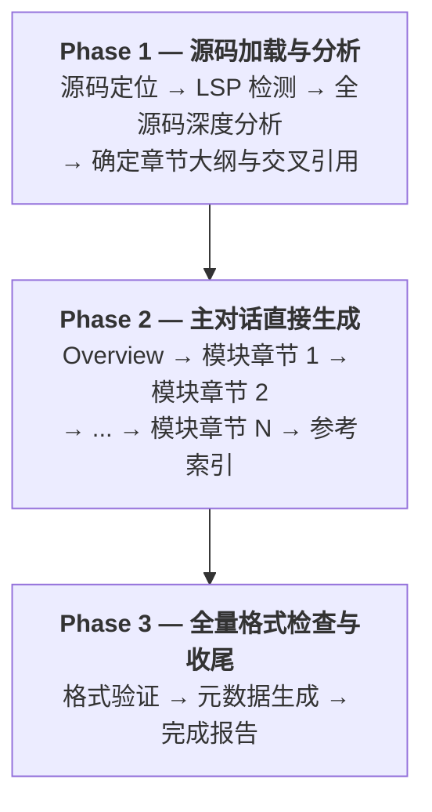

# 消除 Subagent 架构实施计划

> **For Claude:** REQUIRED SUB-SKILL: Use superpowers:executing-plans to implement this plan task-by-task.

**Goal:** 将 study-master 从 subagent 并行架构改为主对话直出架构，目标从 41 分钟降到 20 分钟内。

**Architecture:** 删除所有 subagent 委派逻辑和序列化中间产物（.analysis-context.md），改为主对话在 1M 上下文中直接分析并逐章生成文档。保留格式规范、章节模板和 PostToolUse hook 不变。

**Tech Stack:** Claude Code Skill（Markdown），PostToolUse hook（Python/Bash）

---

### Task 1: 重写 SKILL.md — 三阶段主对话直出工作流

**Files:**
- Modify: `SKILL.md` (全文重写，从 224 行改为 ~160 行)

**Step 1: 重写 SKILL.md**

用以下内容完整替换 `SKILL.md`：

```markdown
---
name: study-master
description: 深入学习开源项目源码、协议规范和语言框架内部机制，生成教科书风格的学习文档
---

# Study-Master Skill

## 概述

帮助程序员深入学习开源项目源码、协议栈实现（如 TCP/IP、HTTP）、特定编程语言或框架的内部机制。生成深度解析型学习文档，采用教科书风格，文档规模根据主题复杂度动态调整。支持自动检测并使用 LSP 增强代码分析。

## 强制目录结构

- `src/` — 源码目录
- `docs/` — 协议规范文档
- `study/<topic>/` — 学习文档输出目录（自动创建）

**规则**：至少 `src/` 或 `docs/` 之一必须存在。两者都不存在时拒绝执行并提示用户调整目录结构。

## 教科书风格原则

生成的文档必须遵循渐进式知识展开：

1. **先整体后局部**：先展示模块在系统中的位置，再深入细节
2. **先接口后实现**：先讲清楚"做什么"，再讲"怎么做"
3. **先主流程后边界**：先追踪正常执行路径，再分析错误处理
4. **先概念后代码**：先用自然语言解释设计思想，再展示代码

## 工作流程

### Phase 1：源码加载与分析

#### 1.1 源码定位与验证

1. 检查 `src/` 或 `docs/` 目录是否存在
2. 按优先级查找：`src/<topic>/` → `src/*<topic>*/` → `docs/<topic>/` → `docs/*<topic>*/` → `./<topic>/`（不区分大小写，支持部分匹配）
3. 找到多个候选时列出让用户选择
4. 输出目录：`study/<topic>/`

#### 1.2 LSP 环境检测

C/C++ 项目自动检测 LSP 可用性，其他语言跳过。

> 📖 详见 [analysis-guide.md](analysis-guide.md) 第 1 节

#### 1.3 主题识别与准备

解析 `<topic>` 参数，判断类型（项目/协议/语言内部机制），确定源码位置，创建 `study/<topic>/`。

#### 1.4 全源码深度分析

利用 1M 上下文窗口，执行全源码深度分析：

1. **源码加载**：Read 项目所有核心源文件到上下文中（1M 上下文可加载约 30000 行代码）
2. **结构分析**：根据 LSP 可用性选择分析方法，识别核心模块、热点函数和模块依赖关系
3. **深度解读**：在拥有全部源码的上下文中完成以下分析：
   - 每个模块的设计意图和职责边界
   - 关键算法和核心函数的逻辑解读（不只是签名，要理解设计动机）
   - 模块间的耦合关系和数据流
   - 关键设计决策和 tradeoff 分析
4. **热点函数深度分析**：对每个核心函数，阅读完整实现，理解内部逻辑、错误处理策略和与其他模块的交互方式

> 📖 分析方法详见 [analysis-guide.md](analysis-guide.md) 第 2-4 节

#### 1.5 确定章节大纲与交叉引用准备

基于深度分析，确定章节划分和学习路径，明确列出所有需要生成的章节。

**必须完成以下准备（结论保留在上下文中，不写文件）：**

1. **计算 `source_path_prefix`**：统计 `study/<topic>/` 相对于项目根的目录层数，每层一个 `../`。例如 `study/redis/` 为 2 层 → `../../`。所有源码路径必须加上此前缀。
2. **预计算「交叉引用锚点映射」表**：根据学习大纲中各章节的预期标题结构，为每个可能被其他章节引用的术语（结构体名、关键函数名）生成 GFM 锚点映射。后续生成每个章节时直接查表使用。

### Phase 2：主对话直接生成文档

**主对话在 1M 上下文中逐章生成所有文档，不使用 subagent。**

生成顺序：严格串行，从概览到模块章节。

```
00-overview.md → 01-xxx.md → 02-xxx.md → ... → NN-xxx.md → appendix-references.md
```

#### 2.1 生成快速导览（00-overview.md）

直接使用 Write 工具一次性输出完整的 `00-overview.md`。

生成要求：
- 包含：项目简介、核心概念速览、典型场景剖析（含完整执行路径追踪）、架构全景图、学习路线图
- 遵循教科书风格原则
- 严格遵守 [format-rules.md](format-rules.md) 的所有格式规范
- 源码链接路径前缀统一使用 Phase 1.5 计算的 `source_path_prefix`
- 交叉引用其他章节时，从锚点映射表查找锚点，格式为 `[术语](./文件.md#锚点)`

> 📖 快速导览模板详见 [document-templates.md](document-templates.md) 第 1 节

#### 2.2 逐章生成模块章节

**必须生成所有计划的章节，不能遗漏。** 对大纲中的每个模块章节，主对话直接执行：

1. **回顾**：在上下文中回顾该模块相关源码（Phase 1 已加载，无需再次 Read）
2. **生成**：按模块章节模板，使用 Write 工具一次性输出完整章节
3. **内嵌交叉引用**：生成时直接查阅上下文中的锚点映射表，当场写入正确的交叉引用链接

生成要求：
- 遵循教科书风格原则：先整体后局部、先接口后实现、先主流程后边界、先概念后代码
- 使用多层次代码展示：调用关系图（Mermaid）→ 伪代码 → 真实代码片段 → 实现细节
- 每个章节根据内容复杂度动态调整长度，确保完整覆盖所有核心函数、关键数据结构和典型使用场景
- 严格遵守 [format-rules.md](format-rules.md) 的所有格式规范
- 源码链接路径前缀统一使用 `source_path_prefix`
- 交叉引用其他章节时，从锚点映射表查找锚点，格式为 `[术语](./文件.md#锚点)`
- 前向引用："这里使用的 `结构体名` 将在[第 N 章：标题](NN-module.md#锚点)中深入解析"
- 后向引用："该函数的调用者 `函数名` 已在[第 N 章：标题](NN-module.md#锚点)中讨论"

> 📖 模块章节模板详见 [document-templates.md](document-templates.md) 第 2 节
> 📖 格式规范详见 [format-rules.md](format-rules.md)

#### 2.3 生成参考索引

最后生成 `appendix-references.md`（参考资料索引）。

### Phase 3：全量格式检查与收尾

**进入条件**：所有计划章节的文件已存在于 `study/<topic>/`。

#### 3.1 全量格式检查

逐文件 Read 检查每个生成的章节：
- 格式合规性（链接格式、Mermaid 图表、反引号规则、LaTeX 数学符号）
- 无乱码（U+FFFD 等）
- 源码引用路径正确（使用 `source_path_prefix`）
- 交叉引用锚点正确（与预计算的锚点映射一致）
- 发现问题时直接用 Edit 修正

#### 3.2 整合收尾

1. 创建 `.study-meta.json`（格式见 [document-templates.md](document-templates.md) 第 4 节）
2. 输出最终报告

> 📖 收尾清单详见 [document-templates.md](document-templates.md) 第 5 节

## 文档结构概要

| 文件 | 内容 |
|------|------|
| `00-overview.md` | 快速导览：项目简介、核心概念、典型场景、架构图、学习路线 |
| `01-module-xxx.md` | 模块深度解析：概述、代码展示、数据结构、算法、设计决策、检查点 |
| `appendix-references.md` | 参考资料索引 |
| `.study-meta.json` | 元数据：主题、路径、LSP 状态、章节列表 |

## 质量控制

- 每个章节根据复杂度动态调整长度，确保内容完整
- 生成后逐文件用 Read 检查乱码，发现 U+FFFD 或格式问题立即修正
- 所有源码引用必须有正确的超链接，验证 LSP 数据准确性

> 📖 格式标准详见 [format-rules.md](format-rules.md)，PostToolUse hook 自动验证格式合规
> 📖 输出规则详见 [document-templates.md](document-templates.md) 第 3 节
```

**Step 2: 验证 SKILL.md**

验证要点：
- 确认不再包含任何 "subagent"、"Agent 工具"、"委派"、".analysis-context.md" 等词汇
- 确认三阶段结构完整：Phase 1（分析）→ Phase 2（生成）→ Phase 3（审查）
- 确认 format-rules.md 和 document-templates.md 的引用路径正确
- 确认教科书风格原则和格式规范要求完整保留

Run: `grep -c "subagent\|Agent 工具\|委派\|\.analysis-context" SKILL.md`
Expected: 0

**Step 3: Commit**

```bash
git add SKILL.md
git commit -m "refactor: rewrite SKILL.md to 3-phase direct generation workflow

Replaces subagent parallel architecture with main-dialogue direct
generation. Eliminates Stage 4 serialization, agent delegation,
and 4-step post-review. Target: 41min → <20min."
```

---

### Task 2: 精简 document-templates.md

**Files:**
- Modify: `document-templates.md` (删除第 6 节，约 148→64 行)

**Step 1: 更新 document-templates.md**

进行以下修改：

1. **修改文件开头说明**（第 1 行）：
   - 旧：`本文件包含 study-master 的文档模板和操作规则，在工作流阶段 4/5/6-N 和收尾阶段按需 Read。`
   - 新：`本文件包含 study-master 的文档模板和操作规则，在 Phase 2（文档生成）和 Phase 3（收尾）阶段按需参考。`

2. **第 1-2 节保持不变**（快速导览模板和模块深度解析模板）

3. **修改第 3 节输出规则**（第 27-33 行区域）：保持不变，内容已正确（Write 一次性输出）

4. **第 4-5 节保持不变**（元数据格式和收尾清单）

5. **删除整个第 6 节**（第 65-148 行）：删除"富分析报告模板（.analysis-context.md）"及其全部子节

**Step 2: 验证**

Run: `grep -c "analysis-context\|subagent\|序列化" document-templates.md`
Expected: 0

**Step 3: Commit**

```bash
git add document-templates.md
git commit -m "refactor: remove analysis-context template from document-templates

Section 6 (rich analysis report template) is no longer needed since
the main dialogue retains analysis in context instead of serializing."
```

---

### Task 3: 微调 analysis-guide.md

**Files:**
- Modify: `analysis-guide.md` (删除第 6 节，约 98→74 行)

**Step 1: 更新 analysis-guide.md**

进行以下修改：

1. **修改文件开头说明**（第 1 行）：
   - 旧：`本文件包含 study-master 的源码分析技术细节，在工作流阶段 1/3/6-N 中按需 Read。`
   - 新：`本文件包含 study-master 的源码分析技术细节，在 Phase 1（源码分析）阶段按需参考。`

2. **第 1-5 节保持不变**（LSP 检测、分析方法表、深度分析流程、函数级分析、可视化选择）

3. **修改第 4 节第 7 条**（第 55 行）：
   - 旧：`7. **记录分析结论**：将以上分析结果写入 `.analysis-context.md` 对应模块的"关键代码片段与解读"部分`
   - 新：`7. **记录分析结论**：将以上分析结果保留在上下文中，供 Phase 2 直接生成文档时使用`

4. **删除整个第 6 节**（第 75-98 行）：删除"序列化深度分析结果"及其全部子节

**Step 2: 验证**

Run: `grep -c "序列化\|\.analysis-context\|subagent" analysis-guide.md`
Expected: 0

**Step 3: Commit**

```bash
git add analysis-guide.md
git commit -m "refactor: remove serialization guide from analysis-guide

Section 6 (serialization steps) removed since analysis conclusions
now stay in context instead of being written to .analysis-context.md."
```

---

### Task 4: 更新 README.md

**Files:**
- Modify: `README.md` (更新架构描述、Mermaid 图、演进表)

**Step 1: 更新 README.md**

进行以下修改：

1. **修改核心特性列表**（第 11 行区域）：
   - 旧：`- **Subagent 并行架构**：多个 AI agent 并行生成各章节，高效处理大型项目`
   - 新：`- **主对话直出架构**：利用 1M 上下文在主对话中直接完成分析和逐章生成，消除序列化开销`

2. **替换 Mermaid 架构图**（第 18-28 行区域），替换为：



3. **替换架构说明段落**（第 30 行区域）：
   - 旧：`主对话利用 1M 上下文完成全源码深度分析，生成包含代码片段和设计解读的富分析报告。subagent 专注于将分析结论转化为教科书风格文档，不再需要自己分析源码。主对话在最后阶段进行内容审查和交叉引用注入，确保文档质量和连贯性。`
   - 新：`主对话利用 1M 上下文完成全源码深度分析后，直接在同一上下文中逐章生成教科书风格文档。分析结论无需序列化，交叉引用在生成时直接内嵌，最后进行全量格式检查确保质量。`

4. **更新生成的文档结构**（第 79 行区域）：
   - 删除 `.analysis-context.md` 那一行

5. **更新模块化设计说明**（第 133-137 行区域）：
   - 旧：
     ```
     - **format-rules.md**：格式规范细节，subagent 在生成前读取
     - **analysis-guide.md**：LSP 检测、分析方法表、函数级深度分析工作流、富分析报告序列化指南
     - **document-templates.md**：快速导览和模块章节模板、富分析报告模板、元数据格式
     ```
   - 新：
     ```
     - **format-rules.md**：格式规范细节，Phase 2 生成和 Phase 3 检查时参考
     - **analysis-guide.md**：LSP 检测、分析方法表、函数级深度分析工作流
     - **document-templates.md**：快速导览和模块章节模板、元数据格式、收尾清单
     ```

6. **更新演进表**（第 143-148 行区域），在 v4 后追加 v5：

| v5 — 主对话直出 | 消除 subagent 架构，主对话直接生成所有章节。实测 agent 串行执行导致并行假设不成立，去掉序列化开销和 agent 启动开销，41 分钟 → 目标 20 分钟 |

**Step 2: 验证**

Run: `grep -c "subagent\|并行生成\|富分析报告\|\.analysis-context" README.md`
Expected: 0

**Step 3: Commit**

```bash
git add README.md
git commit -m "docs: update README for v5 direct generation architecture

Remove subagent references, update Mermaid diagram to 3-phase flow,
add v5 to evolution table."
```

---

### Task 5: 同步重写 SKILL-profiling.md

**Files:**
- Modify: `SKILL-profiling.md` (全文重写，与新 SKILL.md 同步，插入诊断检查点)

**Step 1: 重写 SKILL-profiling.md**

基于 Task 1 中新的 SKILL.md 内容，在每个阶段边界插入诊断检查点。新的检查点结构：

```
Phase 1 开始 → PHASE|phase-1-analysis|start
  1.1-1.3 准备与分析
Phase 1 结束 → PHASE|phase-1-analysis|end

Phase 2 开始 → PHASE|phase-2-generate|start
  2.1 Overview → PHASE|generate-overview|start/end
  2.2 每个章节 → PHASE|generate-{章节文件名}|start/end
  2.3 Appendix → PHASE|generate-appendix|start/end
Phase 2 结束 → PHASE|phase-2-generate|end

Phase 3 开始 → PHASE|phase-3-finalize|start
  3.1 格式检查 → PHASE|format-check|start/end
  3.2 收尾 → PHASE|finalize|start/end
Phase 3 结束 → PHASE|phase-3-finalize|end
```

完整内容：在新 SKILL.md 的基础上，在每个阶段/子阶段的开头和结尾插入以下模式的诊断行：

```
> ⏱️ **[诊断]** {阶段名} 开始，运行：
> ```
> Bash: echo "PHASE|{阶段标识}|start|$(date +%s)" >> study/<topic>/.profiling.log
> ```
```

关键区别点（与旧版对比）：
- 不再有 `AGENT|xxx` 类型的检查点（没有 subagent 了）
- 新增 `generate-overview` 和 `generate-{章节}` 类型的检查点（追踪每章生成耗时）
- Phase 标识从 `stage-0-2`, `stage-3-analysis` 等改为 `phase-1-analysis`, `phase-2-generate`, `phase-3-finalize`

完整重写 SKILL-profiling.md，内容 = 新 SKILL.md + 诊断检查点注入。参照旧 SKILL-profiling.md 的注入模式（blockquote + Bash echo），在新结构的每个子阶段边界插入检查点。

**Step 2: 验证**

确认检查点完整性：
Run: `grep -c "PHASE|" SKILL-profiling.md`
Expected: 至少 14 个（7 个阶段 × start/end）

确认无旧架构残留：
Run: `grep -c "AGENT\|subagent\|\.analysis-context" SKILL-profiling.md`
Expected: 0

**Step 3: Commit**

```bash
git add SKILL-profiling.md
git commit -m "refactor: sync SKILL-profiling.md with new 3-phase architecture

Replace subagent-era checkpoints with per-chapter generation
timing. AGENT checkpoints replaced by PHASE|generate-* checkpoints."
```

---

### Task 6: 同步安装到 ~/.claude/skills/ 并验证

**Files:**
- Sync: `~/.claude/skills/study-master/` (SKILL.md, analysis-guide.md, document-templates.md)

**Step 1: 运行安装脚本**

Run: `cd /Users/ouyangzhaoxin/learning-skills/study-master-skill && ./install.sh`

Expected: 安装成功，SKILL.md、format-rules.md、analysis-guide.md、document-templates.md 同步到 `~/.claude/skills/study-master/`

**Step 2: 验证安装后文件一致性**

Run: `diff SKILL.md ~/.claude/skills/study-master/SKILL.md`
Expected: 无差异

Run: `diff document-templates.md ~/.claude/skills/study-master/document-templates.md`
Expected: 无差异

Run: `diff analysis-guide.md ~/.claude/skills/study-master/analysis-guide.md`
Expected: 无差异

**Step 3: 最终验证 — 确认无旧架构残留**

对安装目录执行全面检查：
Run: `grep -r "subagent\|Agent 工具\|委派\|\.analysis-context\|阶段 4\|阶段 5\|阶段 6" ~/.claude/skills/study-master/`
Expected: 无匹配

**Step 4: Commit（如 install.sh 需要修改的话）**

如果 install.sh 无需修改则跳过此步。

---

### Task 7: 最终集成提交

**Step 1: 确认所有变更已提交**

Run: `git status`
Expected: 工作区干净

Run: `git log --oneline -7`
Expected: 看到 Task 1-5 的 5 个提交

**Step 2: 备份旧版本标签（可选）**

```bash
git tag v4-subagent-architecture HEAD~5
```

这样可以随时回滚到 subagent 架构版本。
